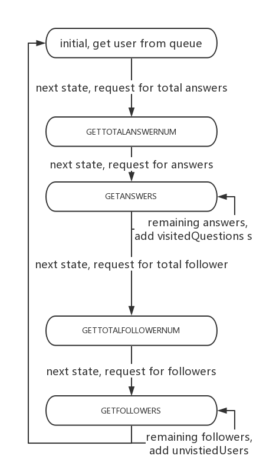
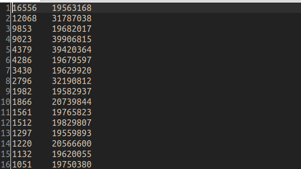

This is a spider, which crawl top answers on [zhihu](https://www.zhihu.com/) website.

### Design Ideas
> * get a user from queue
> * in order to getting a total answer, you should construct a url request;
> * construct a url request, which prepare for real answers from user;
> * parse response json data, extracting 'question->id' and 'voteup_count';
> * questionId should exclusive to visitedQuestions(a set);
> * in order to getting a total follower, you should construct a url request;
> * construct a url request, which prepare for real followers from user;
> * parse response json data, extracting 'answer_count','follower_count' and 'url_token';
> * url_token should exclusive to visitedUsers(a set);

### Enhance
initial version was slow， because spider must suspend for coming data.
So we should take event triggered model.I used system call 'epoll' for high efficiency.

#### keys
Since we have many request, we should save state for current request.So we should use a state machine, which records our current state and reminds states that we been.

### Result：
